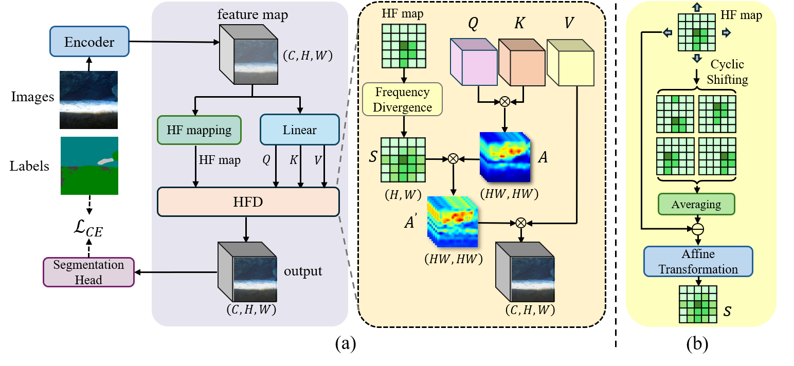

<p align="center">
  <h1 align="center">African water body segmentation with cross-layer information separability based feature decoupling transformer</h1>
  <p align="center">


   <br />
    <strong>Hongbo Xie</strong></a> 
    ·
    <strong>Qi Zhao</strong></a>
    ·
    <strong>Binghao Liu</strong></a>
    ·
    <strong>Chunlei Wang</strong></a>    
    <br />

<p align="center">
 </p>


## Introduction
This repo is the implementation of "African water body segmentation with cross-layer information separability based feature decoupling transformer"

<p align="center">
  
</p>


## Usage

### Install

Clone [MMSegmentation](https://github.com/open-mmlab/mmsegmentation) repo and [HFDNet](https://github.com/cv516Buaa/HongboXie/tree/main/HFDNet) repo, add the codes of `configs`, `mmseg/datasets/SUIM.py` and `mmseg/models/decode_heads/hfd_head.py` into corresponding files of MMSegmentation.

Then, run
`pip install -v -e .`
to regist SUIM dataset and HFDNet model.

### Dataset

The testing SUIM dataset can be found at [SUIM]([SUIM dataset | Minnesota Interactive Robotics and Vision Laboratory](https://irvlab.cs.umn.edu/resources/suim-dataset)) 

### Train and Test

+ Use the following command for training

  ```
  python tools/train.py \
  config_path \
  --work-dir work_path
  ```

+ Use the following command for testing

  ```
  python tools/test.py \
  config_path \
  ckpt_path \
  --work-dir work_path
  ```

## Citation

If you have any question, please discuss with me by sending email to sy2402317@buaa.edu.cn

## References

The code is based on [MMSegmentation](https://github.com/open-mmlab/mmsegmentation). Thanks for their great works!
